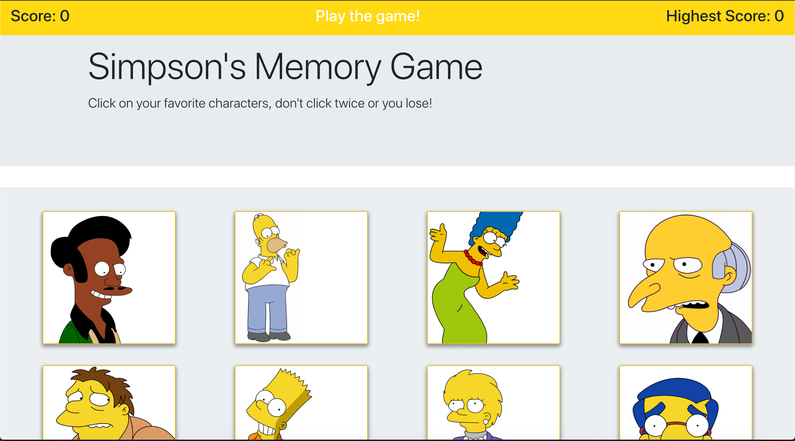

# Simpsons "Clicky Game" 

## Overview
This is a fun "memory" style game where a user has to try and click every photo only once, but the photos change position after each click!

## Deployment 
This app is deployed using heroku. You can see it live [here](https://simpsons-clicky-game.herokuapp.com/).

## Technologies Used 
[React](https://reactjs.org/) 
[Bootstrap](https://getbootstrap.com/) 
[Yarn](https://yarnpkg.com) 
[Node.js](https://nodejs.org/en/) 

## 

